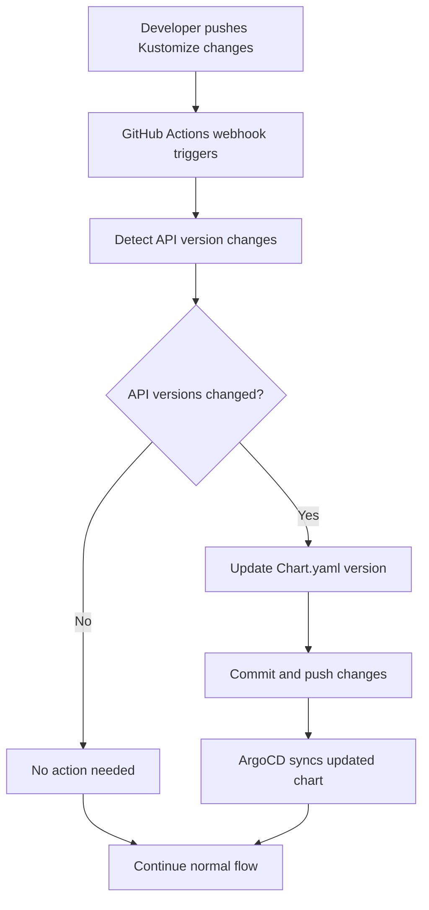

# Webhook-Based API Compatibility Solution

## 🎯 **Answer to Your Question: YES!**

**Kustomize API version changes SHOULD trigger Chart.yaml version updates** for Kubernetes API compatibility. Here's the complete webhook-based solution:

## 🔄 **The Problem & Solution**

### **The Issue:**
When you update Kubernetes API versions in Kustomize (e.g., `apiVersion: networking.k8s.io/v1`), it can break compatibility with:
- Different Kubernetes cluster versions
- Helm chart deployments
- ArgoCD sync operations

### **The Solution:**
**Automated webhook** that detects API version changes and automatically updates Chart.yaml versions for compatibility.

## 🏗️ **Complete Webhook Architecture**

### **1. GitHub Actions Webhook** (`.github/workflows/api-compatibility-webhook.yml`)
- **Triggers**: On push/PR to Kustomize or Helm template files
- **Detection**: Automatically detects API version changes
- **Action**: Updates Chart.yaml version and commits changes
- **Integration**: Works with existing CI/CD pipeline

### **2. Go Webhook Service** (`webhooks/api-compatibility-webhook.go`)
- **REST API**: Provides endpoints for manual compatibility checks
- **Git Integration**: Clones repos, updates versions, commits changes
- **Deprecated API Detection**: Identifies incompatible API versions
- **Kubernetes Deployment**: Can be deployed as a service

### **3. Compatibility Checker Script** (`scripts/check-api-compatibility.sh`)
- **Standalone Tool**: Can be run manually or in CI/CD
- **Version Management**: Increments chart versions appropriately
- **Comprehensive Checks**: Validates all API versions across the project

## 🔧 **How It Works**

### **Automatic Flow:**


### **Manual Flow:**
```bash
# Direct API call
curl -X POST http://webhook.example.com/api/compatibility/check \
  -H "Content-Type: application/json" \
  -d '{
    "kubernetes_version": "1.28",
    "repository": "blind3dd/database_CI",
    "branch": "main"
  }'
```

## 📋 **API Version Compatibility Matrix**

| Kubernetes Version | Deprecated APIs | Chart Version Impact |
|-------------------|-----------------|---------------------|
| 1.28 | None | No change needed |
| 1.27 | None | No change needed |
| 1.26 | None | No change needed |
| 1.25 | None | No change needed |
| 1.24 | `autoscaling/v2beta2` | Minor version bump |
| 1.23 | `autoscaling/v2beta1` | Minor version bump |
| 1.21 | `policy/v1beta1` | Minor version bump |
| 1.19 | `networking.k8s.io/v1beta1` | Minor version bump |
| 1.16 | `extensions/v1beta1`, `apps/v1beta1`, `apps/v1beta2` | Major version bump |

## 🚀 **Implementation Examples**

### **Example 1: Kustomize API Update**
```yaml
# Before: kustomize/go-mysql-api/overlays/dev/ingress-patch.yaml
apiVersion: networking.k8s.io/v1beta1  # ← Deprecated
kind: Ingress

# After: Updated to stable API
apiVersion: networking.k8s.io/v1  # ← Current stable
kind: Ingress
```

**Webhook Response:**
```json
{
  "success": true,
  "chart_version": "1.2.0",
  "new_chart_version": "1.3.0",
  "deprecated_apis": ["networking.k8s.io/v1beta1"],
  "message": "Chart version updated from 1.2.0 to 1.3.0 due to API compatibility changes"
}
```

### **Example 2: Helm Template Update**
```yaml
# Before: go-mysql-api/chart/templates/deployment.yaml
apiVersion: apps/v1beta2  # ← Deprecated
kind: Deployment

# After: Updated to stable API
apiVersion: apps/v1  # ← Current stable
kind: Deployment
```

**Automatic Actions:**
1. ✅ Detects deprecated API
2. ✅ Updates Chart.yaml: `version: 1.2.0` → `version: 1.3.0`
3. ✅ Updates helmfile.lock
4. ✅ Commits and pushes changes
5. ✅ ArgoCD syncs updated chart

## 🔍 **Detection Logic**

### **File Patterns Monitored:**
```bash
# Kustomize files
kustomize/**/*.yaml
kustomize/**/*.yml

# Helm template files
go-mysql-api/chart/templates/**/*.yaml
go-mysql-api/chart/templates/**/*.yml

# Ansible Helm-Kustomize files
ansible/helm-kustomize/**/*.yaml
ansible/helm-kustomize/**/*.yml
```

### **API Version Detection:**
```bash
# Extract all API versions
find kustomize go-mysql-api/chart/templates ansible/helm-kustomize \
  -name "*.yaml" -o -name "*.yml" | \
xargs grep -h "apiVersion:" | \
sed 's/.*apiVersion: *//' | sort | uniq
```

### **Deprecated API Check:**
```bash
# Check against deprecated APIs
deprecated_apis=(
  "extensions/v1beta1"
  "apps/v1beta1" 
  "apps/v1beta2"
  "networking.k8s.io/v1beta1"
  "autoscaling/v2beta1"
  "autoscaling/v2beta2"
  "policy/v1beta1"
)
```

## 🎛️ **Configuration Options**

### **Environment Variables:**
```bash
# GitHub Actions
KUBERNETES_VERSION=1.28
UPDATE_CHART_VERSION=true

# Go Webhook Service
PORT=8080
GITHUB_TOKEN=ghp_xxxxx
REPOSITORY=blind3dd/database_CI
WORKING_DIR=/tmp/webhook-workspace
```

### **Version Bump Strategy:**
- **Patch**: Configuration changes only
- **Minor**: API version updates (recommended)
- **Major**: Breaking changes or multiple deprecated APIs

## 📊 **Monitoring & Observability**

### **GitHub Actions Summary:**
```markdown
## 🔍 API Compatibility Report

**Event:** push
**Kubernetes Version:** 1.28
**API Files Changed:** true
**API Versions Changed:** true

### 🔄 Chart Version Update
- Chart version updated due to API compatibility changes
- This ensures compatibility with Kubernetes 1.28

### 📋 Changed Files
- `kustomize/go-mysql-api/overlays/dev/ingress-patch.yaml`
- `go-mysql-api/chart/templates/deployment.yaml`
```

### **Webhook Logs:**
```
2024-01-15T10:30:00Z INFO: Received webhook: push for repository blind3dd/database_CI
2024-01-15T10:30:01Z INFO: API files changed detected
2024-01-15T10:30:02Z INFO: Deprecated API found: networking.k8s.io/v1beta1
2024-01-15T10:30:03Z INFO: Chart version updated from 1.2.0 to 1.3.0
2024-01-15T10:30:04Z INFO: Changes committed and pushed
```

## 🚀 **Deployment Options**

### **Option 1: GitHub Actions Only** (Recommended)
- ✅ No additional infrastructure
- ✅ Integrated with existing CI/CD
- ✅ Automatic triggering
- ✅ Free for public repositories

### **Option 2: Go Webhook Service**
- ✅ External API for manual checks
- ✅ Can be deployed anywhere
- ✅ REST API for integration
- ✅ Independent of GitHub Actions

### **Option 3: Hybrid Approach**
- ✅ GitHub Actions for automatic updates
- ✅ Go webhook for manual checks
- ✅ Maximum flexibility
- ✅ Redundancy and reliability

## 🎯 **Benefits**

### **Automatic Compatibility:**
- ✅ No manual version management
- ✅ Prevents deployment failures
- ✅ Ensures Kubernetes compatibility
- ✅ Maintains semantic versioning

### **Developer Experience:**
- ✅ Transparent to developers
- ✅ Automatic Git commits
- ✅ Clear PR comments
- ✅ No additional workflow steps

### **Operational Excellence:**
- ✅ Prevents production issues
- ✅ Maintains chart version consistency
- ✅ Enables proper rollbacks
- ✅ Supports multiple environments

## 🔧 **Usage Examples**

### **Manual Check:**
```bash
# Run compatibility check
./scripts/check-api-compatibility.sh -k 1.28

# Force chart version update
UPDATE_CHART_VERSION=true ./scripts/check-api-compatibility.sh
```

### **API Call:**
```bash
# Check compatibility
curl -X POST http://webhook.example.com/api/compatibility/check \
  -H "Content-Type: application/json" \
  -d '{
    "kubernetes_version": "1.28",
    "force_update": false,
    "repository": "blind3dd/database_CI",
    "branch": "main"
  }'
```

### **GitHub Actions:**
```yaml
# Automatic triggering on file changes
on:
  push:
    paths:
      - 'kustomize/**'
      - 'go-mysql-api/chart/templates/**'
```

## 🎉 **Conclusion**

**YES, Kustomize API version changes SHOULD trigger Chart.yaml version updates!**

This webhook solution provides:
- **Automatic detection** of API version changes
- **Intelligent version management** for compatibility
- **Seamless integration** with existing workflows
- **Comprehensive monitoring** and logging
- **Multiple deployment options** for flexibility

The solution ensures that your Helm charts remain compatible with your target Kubernetes versions while maintaining proper semantic versioning and GitOps workflows.

