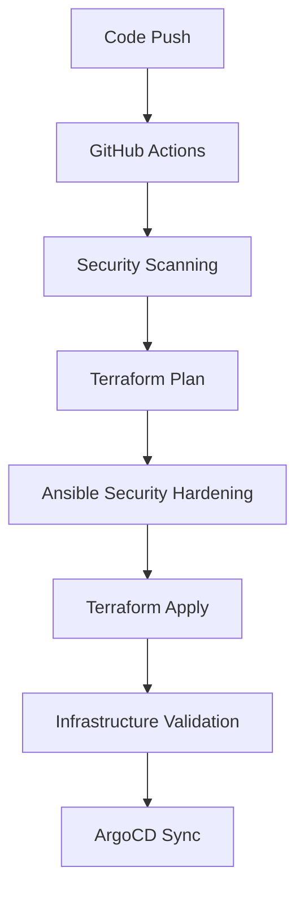
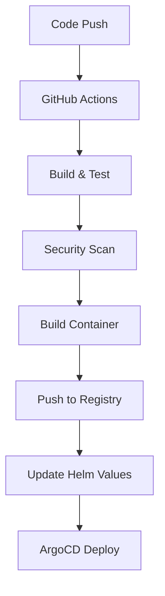
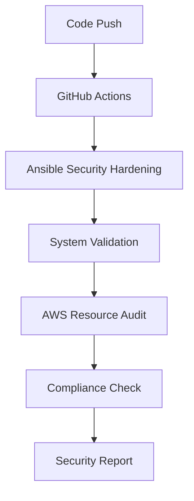

# Hybrid Infrastructure Architecture

## Overview

This document defines the hybrid architecture approach that combines GitHub Actions, Ansible, and ArgoCD to provide a comprehensive infrastructure and application deployment solution.

## Architecture Principles

### 1. **Separation of Concerns**
- **GitHub Actions**: CI/CD, Infrastructure Provisioning, System Hardening
- **Ansible**: System-level Security, Cross-platform Operations, Infrastructure Validation
- **ArgoCD**: Kubernetes Application Management, GitOps Workflows

### 2. **Tool Specialization**
Each tool is used for what it does best:
- GitHub Actions excels at CI/CD pipelines and cloud-native operations
- Ansible excels at system-level configurations and cross-platform operations
- ArgoCD excels at Kubernetes application lifecycle management

### 3. **Security First**
- Security hardening is handled by Ansible for system-level operations
- Security scanning is integrated into GitHub Actions workflows
- Security policies are enforced through ArgoCD and Kubernetes

## Component Responsibilities

### GitHub Actions

#### **Infrastructure Provisioning**
- Terraform infrastructure deployment
- Environment promotion (dev → test → prod)
- Infrastructure validation and compliance
- Cost optimization and resource auditing

#### **System Hardening**
- Ansible playbook execution for security hardening
- Cross-platform security configurations (Linux, macOS, Windows)
- AWS resource auditing and cleanup
- System-level security validation

#### **CI/CD Pipeline**
- Code quality checks and security scanning
- Container image building and registry management
- Testing pipeline execution
- Deployment coordination

#### **Testing & Validation**
- Security scanning (SAST, DAST, container scanning)
- Infrastructure compliance checks
- Performance testing
- Integration testing

### Ansible

#### **System Security Hardening**
- SELinux policy compilation and deployment
- Seccomp profile management
- Cross-platform security hardening
- System-level security configurations

#### **Infrastructure Validation**
- AWS resource auditing and cleanup
- System configuration validation
- Security baseline enforcement
- Compliance checking

#### **Cross-Platform Operations**
- Linux security hardening
- macOS security hardening
- Windows security hardening
- Consistent security policies across platforms

### ArgoCD

#### **Kubernetes Application Management**
- Application lifecycle management
- Version control and rollbacks
- Environment-specific configurations
- Dependency management

#### **GitOps Workflow**
- Continuous deployment from Git
- Automated sync and drift detection
- Application health monitoring
- Rollback capabilities

#### **Deployment Methods**
- **Helm Deployments**: Complex applications with templating
- **Kustomize Deployments**: Environment-specific overlays
- **Raw YAML**: Simple applications and configurations

## Workflow Integration

### 1. **Infrastructure Pipeline**

### 2. **Application Pipeline**

### 3. **Security Pipeline**

## Environment Strategy

### Development Environment
- **GitHub Actions**: Automated testing and validation
- **Ansible**: Development security hardening
- **ArgoCD**: Development application deployments

### Test Environment
- **GitHub Actions**: Integration testing
- **Ansible**: Test environment security hardening
- **ArgoCD**: Test application deployments

### Production Environment
- **GitHub Actions**: Production deployment with approval gates
- **Ansible**: Production security hardening
- **ArgoCD**: Production application deployments with sync windows

## Security Considerations

### 1. **Access Control**
- GitHub Actions uses OIDC for AWS authentication
- Ansible uses SSH keys for system access
- ArgoCD uses RBAC for Kubernetes access

### 2. **Secret Management**
- GitHub Secrets for CI/CD secrets
- AWS Systems Manager Parameter Store for infrastructure secrets
- Kubernetes Secrets for application secrets
- Vault for advanced secret management

### 3. **Network Security**
- Private subnets for infrastructure
- Security groups for access control
- Network policies for Kubernetes
- Istio service mesh for microservices

### 4. **Compliance**
- CIS Kubernetes Benchmark
- NIST Cybersecurity Framework
- SOC 2 Type II
- GDPR compliance
- HIPAA compliance
- PCI DSS compliance

## Monitoring and Observability

### 1. **Infrastructure Monitoring**
- CloudWatch for AWS resources
- Prometheus for Kubernetes metrics
- Grafana for visualization
- AlertManager for alerting

### 2. **Application Monitoring**
- Application metrics and logs
- Distributed tracing
- Performance monitoring
- Error tracking

### 3. **Security Monitoring**
- Security event logging
- Audit trail maintenance
- Threat detection
- Compliance reporting

## Disaster Recovery

### 1. **Backup Strategy**
- Infrastructure state backup
- Application data backup
- Configuration backup
- Secret backup

### 2. **Recovery Procedures**
- Infrastructure recovery
- Application recovery
- Data recovery
- Configuration recovery

### 3. **Testing**
- Regular disaster recovery testing
- Backup validation
- Recovery time objectives
- Recovery point objectives

## Best Practices

### 1. **GitHub Actions**
- Use reusable workflows
- Implement proper secret management
- Use environment protection rules
- Implement proper error handling

### 2. **Ansible**
- Use idempotent playbooks
- Implement proper error handling
- Use variables for configuration
- Implement proper testing

### 3. **ArgoCD**
- Use proper sync policies
- Implement health checks
- Use proper resource limits
- Implement proper rollback strategies

### 4. **Security**
- Implement defense in depth
- Use least privilege access
- Regular security updates
- Continuous security monitoring

## Troubleshooting

### 1. **Common Issues**
- GitHub Actions workflow failures
- Ansible playbook failures
- ArgoCD sync failures
- Kubernetes deployment issues

### 2. **Debugging Steps**
- Check logs and error messages
- Validate configurations
- Test in development environment
- Use debugging tools

### 3. **Recovery Procedures**
- Rollback to previous version
- Fix configuration issues
- Restart failed components
- Escalate to support team

## Future Enhancements

### 1. **Automation Improvements**
- Enhanced testing automation
- Improved deployment automation
- Better monitoring automation
- Advanced security automation

### 2. **Tool Integration**
- Better tool integration
- Improved workflow orchestration
- Enhanced monitoring integration
- Advanced security integration

### 3. **Scalability**
- Horizontal scaling
- Vertical scaling
- Performance optimization
- Resource optimization

## Conclusion

This hybrid architecture provides a robust, secure, and scalable solution for infrastructure and application management. By leveraging the strengths of each tool, we achieve:

- **Comprehensive Security**: System-level and application-level security
- **Cross-Platform Support**: Linux, macOS, and Windows support
- **GitOps Workflow**: Continuous deployment and configuration management
- **Compliance**: Multiple compliance frameworks support
- **Scalability**: Horizontal and vertical scaling capabilities
- **Maintainability**: Clear separation of concerns and responsibilities

The architecture is designed to be flexible, allowing for future enhancements and modifications as requirements evolve.

